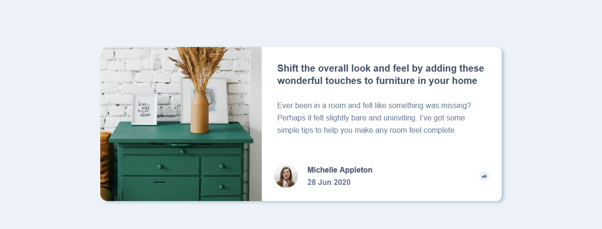

# Frontend Mentor - Article preview component

## Table of contents

- [The challenge](#the-challenge)
- [Screenshot](#screenshot)
- [Built with](#built-with)
- [What I learned](#what-i-learned)
- [Continued development](#continued-development)
- [Author](#author)

### The challenge

Users should be able to:

- View the optimal layout depending on their device's screen size
- See hover states for interactive elements

### Screenshot

### Links

- Live Site URL: [https://article-card-emjogale.vercel.app/](https://article-card-emjogale.vercel.app/)

### Built with

- Semantic HTML5 markup
- CSS custom properties
- Flexbox and grid layout
- Mobile-first workflow

### What I learned

I should write the README file alongside working on the project and not leave it until after I've finished!

### Continued development

I need to improve a lot on the implementation of the javascript aspects and also the css needs improvement - the active states aren't working correctly yet - certainly in some of the smaller screen sizes.

## Author

- Frontend Mentor - [@emjogale](https://www.frontendmentor.io/profile/emjogale)
- Twitter - [@emmagale2635](https://www.twitter.com/emmagale2635)
